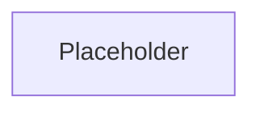

# Serverless URL Shortener

A basic serverless URL shortener template built on AWS - Lambda, API Gateway, Dynamo, S3, and Cloudfront provisioning - deployed entirely through Terraform.

## Table of Contents

- [Features](#features)
- [Tech Stack](#tech-stack)
- [Architecture](#architecture)
- [Project Structure](#project-structure)
- [Getting Started](#getting-started)
  - [Prerequisites](#prerequisites)
  - [AWS](#aws)
  - [Installation](#installation)
- [API Reference](#api-reference)
- [Contributing](#contributing)
- [License](#license)

## Features

## Tech Stack

## Architecture



## Project Structure

```bash
.
├── .gitignore
├── LICENSE
├── README.md
├── infrastructure/
│   ├── main.tf
│   ├── variables.tf
│   ├── storage.tf
│   ├── compute.tf
│   ├── api.tf
│   ├── edge.tf
│   ├── dns.tf
│   ├── outputs.tf
│   └── .terraform
│       └── terraform.tfstate
└── backend/
    ├── lambda_function.py
    ├── requirements.txt
    └── build/                        # Created during deployment - see below, not committed
```

## Getting Started

### Prerequisites

- **Terraform** `v1.5.0+`
- **Python** `v3.11.X`
- **pip** `v23.0+`
- **AWS CLI** `v2.X`
- **WSL** (*for Windows users only - needed for installation of Python libraries in Linux Binaries*)

### AWS

- **Active AWS Account** with billing setup/enabled
- **IAM Privileges**
  - AWS Lambda
  - IAM Roles/Policies
  - API Gateway (HTTP API v2)
  - S3 bucket
  - DynamoDB
  - Route 53
  - AWS Certificate Manager
  - CloudFront

### Domain Names

- **Two registered domain names**
  - Main/long domain
  - Short domain
- **Registrar Admin Access**

### Installation

1. Clone the repo and set your AWS credentials

   ```bash
   git clone https://github.com/EliaPym/URL-Shortener.git
   cd <repo>
   aws configure
   ```

2. Update `./infrastructure/variables.tf` with the following:
   - **Preferred deployment region:** `aws_region`
   - **Project name:** `project_name`
   - **Main URL (frontend):** `main_url`
   - **Short URL:** `short_url`
   - **API URL:** `api_url` (*must be in the form of* `prefix.<short-url>.<tld>`)
3. Update the hardcoded domain `short_url` in `./backend/lambda_function.py`.

## API Reference

## Contributing

## License

Distributed under the MIT License. See [LICENSE](LICENSE) for details.

---

**Elia Pym |** [elia.pym@e-p.dev](mailto:elia.pym@e-p.dev) **|** [LinkedIn](https://linkedin.com/in/EliaPym) **|** [GitHub](https://github.com/EliaPym)
